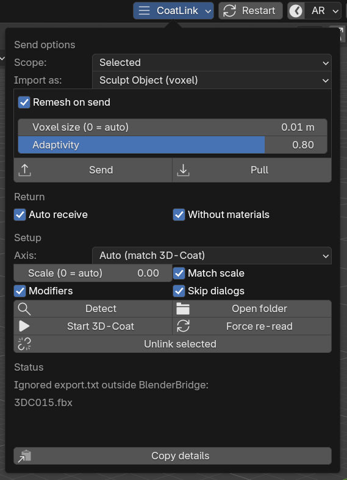
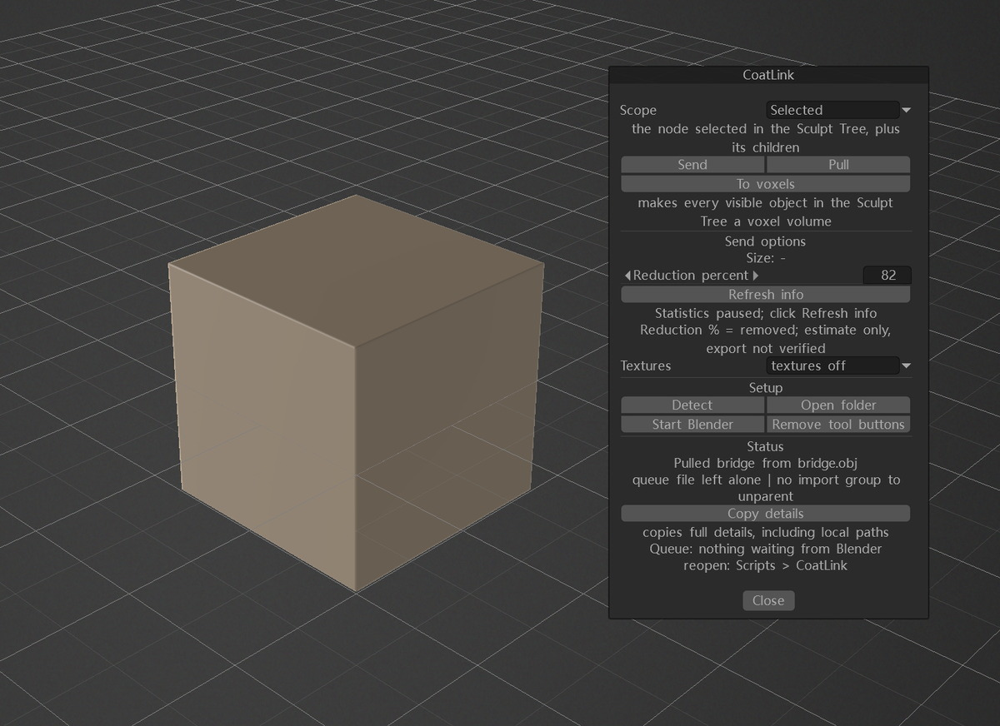

# CoatLink

**A small, predictable two-way model bridge between Blender and 3D-Coat.** Models only: no
baking, no texture nodes, no scene surgery.




<sub>The CoatLink menu in Blender's top bar &nbsp;·&nbsp; the CoatLink panel in 3D-Coat.  Both carry
the same sections in the same order.</sub>

* one **CoatLink** button in Blender's top bar and one panel in 3D-Coat - both carry the same
  sections in the same order with the same words
* `Send` / `Pull` in both directions.  Objects keep their names, their materials and their
  place in the outliner; nothing in your scene is renamed, joined or deleted
* units and axes are read from 3D-Coat itself, so 2 m in Blender is 2 m in 3D-Coat
* optional voxel remesh on send (over the exported copy only), and one-click `To voxels` in
  3D-Coat that converts what the Sculpt Tree is showing

## Install

### Blender - no commands at all

1. Download **`coat_bridge.zip`** from the [latest release](../../releases/latest).
2. In Blender: **Edit > Preferences > Add-ons > ▾ (top right) > Install from Disk…** and pick
   that zip (Blender 4.2 and newer).
3. Enable **CoatLink** in the add-on list, then press **Detect** in its menu.

### 3D-Coat - double-click one file

Download **`CoatLink-Setup.cmd`** and double-click it.  It fetches the installer from the latest
release, runs it with the Python 3D-Coat itself ships, and keeps the window open so you can read
what it did.  Nothing to unzip, no console, no path to edit.  If 3D-Coat sits under
`C:\Program Files` the button icons need administrator rights, so it asks Windows for elevation
once and runs the installer again: that single prompt is the whole privilege story, and without it
everything except the icons still installs.  The file is short enough to read before you run it.

Already have the release unzipped?  `install.cmd` does the same thing from the files in front of
it.  It finds both folders on its own, writes the menu entries with **your** paths, clears out
anything an older layout left behind, and is harmless to run twice.

Both folders are worked out on the spot, wherever 3D-Coat is: the program folder comes from the
uninstall entries Windows keeps, and its data folder follows **your** Documents folder - which is
where it is *not* once Documents is redirected to OneDrive.  3D-Coat from a folder of your own, on
any drive, works too.

Already in the **Scripts > Show Python console**?  Paste this one line - it needs no download
either (the console is on 3D-Coat's own Python):

```python
import urllib.request; exec(urllib.request.urlopen("https://github.com/VictoryLuode/Blender-CoatLink/releases/latest/download/CoatLink-Setup.py").read().decode())
```

With git-bash, MSYS or WSL, `./install.sh` does the 3D-Coat half too.  PowerShell does both
halves in one go:

```powershell
.\install.ps1
```

If Windows refuses to run scripts, start it explicitly - normal and safe for a script you
just downloaded and read:

```powershell
powershell -NoProfile -ExecutionPolicy Bypass -File .\install.ps1
```

**Every door runs the same installer** (`coat_side/CoatLinkInstall.py`): the `.cmd` and the
console line only fetch it.  A test installs with each door into a throwaway tree and compares
the results file by file, so they cannot drift apart.

Then **restart 3D-Coat** and look for **Scripts > CoatLink**.  Three tool buttons also appear
at the end of the Sculpt and Paint tool lists.  To take it all back out:
`install.cmd --uninstall` (or `.\install.ps1 -Uninstall`, `./install.sh --uninstall`,
`python CoatLinkInstall.py --uninstall`) - it removes its own files and nothing else.

Copying the files by hand, explicit install paths and the XML 3D-Coat needs:
[docs/install.md](docs/install.md).

## Use

1. `Scope` picks the selected object (default) or every visible one.  `Import as` picks how
   3D-Coat opens it - `Sculpt Object (voxel)` by default.  `Remesh on send` can voxel-remesh
   the exported copy only; the scene, the names and your own modifiers stay as they are.
2. **`Send`**.  If 3D-Coat is not running, the job waits in the exchange folder until it is -
   `Start 3D-Coat` is right there in the menu.
3. Work in 3D-Coat, then **`File > Export To > BlenderBridge`** (or `Bring object back`).
   With **Auto receive** on, the model is imported within ~2 s and merged into the object it
   came from: same name, same materials, same place in the outliner, new geometry.

From the 3D-Coat side, `Send` hands over **the node selected in the Sculpt Tree plus its
children** (`Scope: whole scene` uses 3D-Coat's own export instead - the only route that can
carry textures), and `To voxels` converts everything the tree is showing.  It does that by
pressing 3D-Coat's own S/V badge - the conversion you would do by hand - and accepts the
dialog for you, so a scene converts from one click.

What every entry does, on both sides: [docs/menus.md](docs/menus.md).

## How it works

One exchange folder, one file layout, one vocabulary:

```
<3D-Coat exchange root>/
    import.txt                 the job: what to load, where to return, how to open it
    BlenderBridge/             our folder - everything else lives in here
        bridge.obj             the model, both directions (one axis rule, one unit rule)
        export.txt             written by 3D-Coat when it hands a model back
        pull-history.json      what was already imported, so a restart does not repeat it
    CoatLink_AfterImport.py    run after the import: drops 3D-Coat's wrapper node
```

Nothing else is written, and only files inside a `BlenderBridge` folder are ever touched -
with one exception: the job file `import.txt`.  3D-Coat polls that file only at the exchange
root, and the official Blender AppLink queues its jobs in the very same file (its own source
writes the model path first).  The two add-ons can therefore stay enabled side by side, but
not send at the same instant: whichever writes last owns the queue.  CoatLink says so in the
log when it replaces a job that was not its own, and it never imports or deletes a job
pointing outside its own folder.  Measurements, the two exchange roots and the differences
from the official AppLink: [docs/protocol.md](docs/protocol.md).

## Requirements

Blender 4.2+ (developed on 5.2 LTS) · 3D-Coat **2025.12 or newer** (tested against 2025 and
2026) · **Windows** - the installers, the exchange layout and both test suites assume it.
The unparenting step after an import - 3D-Coat runs the script the add-on drops beside the job -
needs 3D-Coat 2025.12, so older builds are not supported; 3D-Coat 2026 keeps its own Python and
user data in versioned folders and both halves look those up rather than assuming a name.
3D-Coat ships the Python its half needs, so nothing else has to be installed.

## Known limitations

Stated plainly, because a bridge that quietly does half the job is worse than one that says
so:

* **The `[vox]` import mode is asked for, not guaranteed.**  3D-Coat's own log shows it
  reading that line, but on the build this was developed against the model still arrives in
  *surface* mode (S in the Sculpt Tree).  `To voxels` in the panel is the reliable route; the
  cause has not been identified.
* **No live round trip has been run on this release.**  Both suites run headless against a
  stand-in host; `tests/live_roundtrip.sh` exists for a real one and records the exact job
  file it wrote, which is the evidence the earlier attempts were missing.
* **The reduction percentage is an estimate**, and `To voxels` accepts the conversion
  dialog's defaults - so one object cannot be skipped mid-run.
* **Button icons need an elevated run** when 3D-Coat lives under `C:\Program Files`; without
  it the buttons simply use their default icons, and the installer reports that.
* **3D-Coat's "whole scene" export is 3D-Coat's own**, so what it covers is its decision.

The full list, including what is deliberately not shipped:
[docs/limitations.md](docs/limitations.md).

## Tests

```bash
tests/run_tests.sh                                   # Blender side, headless
coat_side/tests/run_tests.sh                         # 3D-Coat side, stand-in host
tests/test_coat_export.sh path/to/real-export.obj     # the return leg on a file 3D-Coat wrote
tests/live_roundtrip.sh 900                           # the real thing: both apps open
```

No 3D-Coat and no Blender GUI are needed for the suites: the Blender tests drive throwaway
script and exchange folders, and the 3D-Coat tests run against a stand-in `coat` module on
3D-Coat's own Python.  The scripts pick the newest Blender build and 3D-Coat's bundled Python
themselves; `BLENDER=`, `COAT_PYTHON=` and `COAT_DIR=` override.

Current counts: Blender main suite **213/213** plus every regression script and both installer
smoke tests; 3D-Coat logic **166/166**, tools **29/29**, tree report **12/12**, installer
checks, API stub check, idle-redraw check and probe dry run.

## License

GPL-3.0-or-later, see [LICENSE](LICENSE).  Copyright (C) 2026 VictoryLuode.
